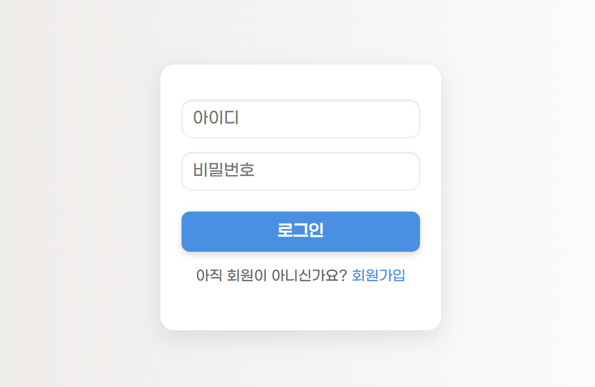
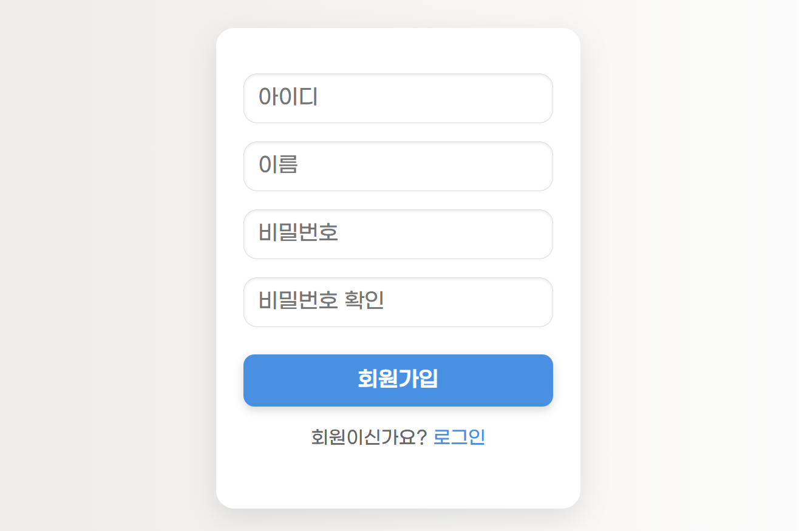
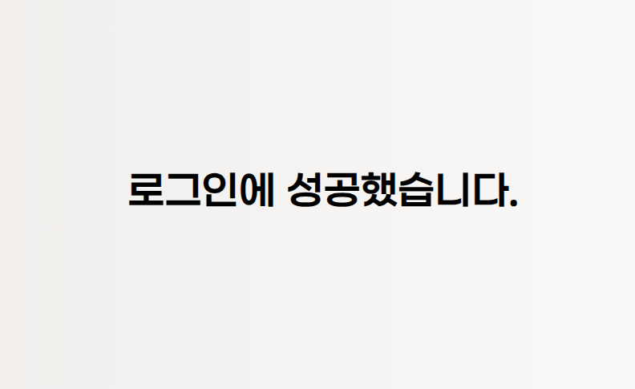

# Node.js 로그인 & 회원가입 기능 구현
유튜브 강의를 따라 하며 Node.js + Express로 로그인 및 회원가입 기능을 직접 구현했습니다.  
프론트엔드와 백엔드가 연결되는 흐름을 실습했습니다.

## 시청한 유튜브 강의
[[Node.js] 백엔드 맛보기](https://www.youtube.com/playlist?list=PLSK4WsJ8JS4cQ-niGNum4bkK_THHOizTs)  

## 구현한 기능
### Node.js / Express
- `Express`로 웹 서버 구성해보기
- `nodemon`으로 코드 수정 시 자동 반영
- REST API 기본 구조 이해 및 라우팅 구현

### 프로젝트 구조화
- MVC 패턴: 라우터 → 컨트롤러 → 모델 흐름 익히기
- 모듈화: 기능을 역할별로 나누어 관리하는 방식 학습
- `package.json`으로 의존성과 버전 관리

### 데이터 & 저장소
- JSON 파일을 간단한 DB처럼 다루기
- AWS RDS(MySQL) 연결 실습(DB 클라우드 활용)
- `.env`로 DB 정보 보안 관리

### API & 요청 처리
- `fetch`를 이용한 클라이언트 → 서버 요청 보내기
- 서버에서 응답을 받고 DOM에 표시
- API 만들기 및 RESTful 응답 처리(GET, POST 등)

### 테스트 및 디버깅
- 서버 API 테스트 도구(Postman 등) 사용법
- 응답 데이터 확인 및 상태코드(200, 404, 500 등) 처리 방법

### 로그 관리
- `winston`을 이용한 로깅 설정(콘솔 + 파일)
- 에러, 요청, 성공 등을 구분하여 로깅
- 개발환경과 배포환경(log level) 구분 설정

## 사용 기술
- Node.js
- JavaScript
- JSON
- winston
- AWS

## 화면 미리보기
### 로그인 페이지

### 회원가입 페이지

### 로그인 성공 페이지

