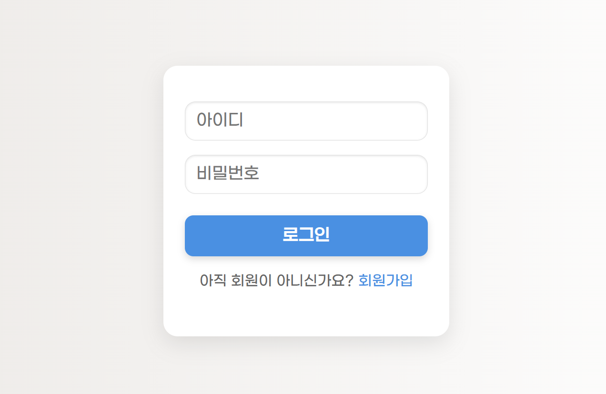

# Login Lecture
이 프로젝트는 간단한 회원가입, 로그인 기능을 포함한 학습용 웹 애플리케이션입니다. 
Node.js와 Express로 서버를 구현하고, 프론트엔드는 EJS 템플릿 엔진을 사용했습니다. 
서버는 MySQL과 연동되며, 데이터는 fetch API를 통해 전송됩니다.

### 🛠️ 사용 기술
- Node.js
- Express
- EJS
- MySQL
- Winston
- dotenv

### ✨ 주요 기능
- 회원가입
- 로그인
- 로그인 성공 화면 표시

### 🖥️ 실행 화면

